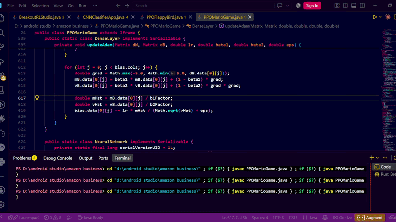

# PPO Mario From Scratch
A Mario-style 2D platformer where an AI agent learns to play using Proximal Policy Optimization (PPO) — built entirely from scratch in Java. No PyTorch/TensorFlow: custom matrix ops, dense layers, Adam optimizer, actor-critic network, GAE, and a live Swing training dashboard.

# PPO Mario-Style Platformer — Java

A Mario-style 2D platformer where an agent learns to play using **Proximal Policy Optimization (PPO)**.

I built the RL stack from scratch in Java rather than using PyTorch, TensorFlow, or another deep-learning framework. The project includes my own matrix operations, neural-network layers, Adam optimizer, Actor-Critic model, PPO training logic, GAE, game physics, environment, and Swing visualization.



---

## What I Built

The project is basically a small reinforcement-learning stack running inside a 2D platformer.

```text
              ┌─────────────────────┐
              │   Mario Environment  │
              │ Physics / Platforms  │
              │ Enemies / Coins      │
              └──────────┬──────────┘
                         │
                       State
                         │
                         ▼
              ┌─────────────────────┐
              │    Actor-Critic     │
              │                     │
              │ Actor → π(a|s)      │
              │ Critic → V(s)       │
              └──────────┬──────────┘
                         │
                       Action
                         │
                         ▼
              ┌─────────────────────┐
              │     Environment     │
              └──────────┬──────────┘
                         │
                  Reward + Next State
                         │
                         ▼
              ┌─────────────────────┐
              │       GAE           │
              │ Advantage Estimates │
              └──────────┬──────────┘
                         │
                         ▼
              ┌─────────────────────┐
              │      PPO Update     │
              └─────────────────────┘
```

---

# 1. Neural Network From Scratch

The neural-network code is built around a small matrix library and dense layers.

A layer performs:

```text
Z = XW + b
A = activation(Z)
```

The implementation stores intermediate values from the forward pass so they can be reused during backpropagation.

```java
public DenseLayer(int inSize, int outSize, String activation) {
    this.weights = Matrix.randomXavier(inSize, outSize);
    this.bias = new Matrix(1, outSize);
    this.activation = activation;

    mW = new Matrix(inSize, outSize);
    vW = new Matrix(inSize, outSize);

    mB = new Matrix(1, outSize);
    vB = new Matrix(1, outSize);
}
```

I use **Xavier initialization** for the weights and maintain separate first and second moments for Adam.

### Forward Pass

```java
public Matrix forward(Matrix input) {

    this.lastInput = input;

    this.lastLinearOutput =
        Matrix.multiply(input, weights)
              .addRowVector(bias);

    if ("relu".equalsIgnoreCase(activation)) {

        this.lastActivationOutput =
            this.lastLinearOutput.relu();

    } else if ("softmax".equalsIgnoreCase(activation)) {

        this.lastActivationOutput =
            this.lastLinearOutput.softmax();

    } else {

        this.lastActivationOutput =
            this.lastLinearOutput;
    }

    return this.lastActivationOutput;
}
```

The hidden layers use **ReLU**, while the actor output uses **Softmax** to produce an action probability distribution.

---

# 2. Backpropagation

The backward pass calculates gradients for the weights, biases, and previous layer.

```java
public Matrix backward(Matrix dL_dOut) {

    Matrix dL_dZ;

    if ("relu".equalsIgnoreCase(activation)) {

        dL_dZ =
            dL_dOut.elementwiseMultiply(
                lastLinearOutput.reluDerivative()
            );

    } else {

        dL_dZ = dL_dOut;
    }

    Matrix dL_dW =
        Matrix.multiply(
            lastInput.transpose(),
            dL_dZ
        );

    Matrix dL_dB =
        dL_dZ.sumColumns();

    Matrix dL_dIn =
        Matrix.multiply(
            dL_dZ,
            weights.transpose()
        );

    updateAdam(
        dL_dW,
        dL_dB,
        0.0005,
        0.9,
        0.999,
        1e-8
    );

    return dL_dIn;
}
```

So the gradient flow is:

```text
Loss
 ↓
Output Layer
 ↓
Hidden Layers
 ↓
Input
```

Each layer calculates its gradients and updates its own parameters.

---

# 3. Adam Optimizer

I implemented **Adam** directly inside the dense layer.

The optimizer keeps:

* `mW`, `vW` — first and second moments for weights
* `mB`, `vB` — first and second moments for biases
* `t` — optimization timestep

```java
private Matrix mW, vW, mB, vB;
private int t = 0;
```

The update uses the standard Adam parameters:

```text
learning rate = 0.0005
β₁ = 0.9
β₂ = 0.999
ε = 1e-8
```

The implementation also clips gradients to prevent extremely large updates.

```java
private void updateAdam(
        Matrix dW,
        Matrix dB,
        double lr,
        double beta1,
        double beta2,
        double eps) {

    t++;

    double b1Factor =
        1.0 - Math.pow(beta1, t);

    double b2Factor =
        1.0 - Math.pow(beta2, t);

    for (int i = 0; i < weights.rows; i++) {

        for (int j = 0; j < weights.cols; j++) {

            double grad =
                Math.max(
                    -5.0,
                    Math.min(5.0, dW.data[i][j])
                );

            mW.data[i][j] =
                beta1 * mW.data[i][j]
                + (1 - beta1) * grad;

            vW.data[i][j] =
                beta2 * vW.data[i][j]
                + (1 - beta2) * grad * grad;

            double mHat =
                mW.data[i][j] / b1Factor;

            double vHat =
                vW.data[i][j] / b2Factor;

            weights.data[i][j] -=
                lr * mHat /
                (Math.sqrt(vHat) + eps);
        }
    }

    for (int j = 0; j < bias.cols; j++) {

        double grad =
            Math.max(
                -5.0,
                Math.min(5.0, dB.data[0][j])
            );

        mB.data[0][j] =
            beta1 * mB.data[0][j]
            + (1 - beta1) * grad;

        vB.data[0][j] =
            beta2 * vB.data[0][j]
            + (1 - beta2) * grad * grad;

        double mHat =
            mB.data[0][j] / b1Factor;

        double vHat =
            vB.data[0][j] / b2Factor;

        bias.data[0][j] -=
            lr * mHat /
            (Math.sqrt(vHat) + eps);
    }
}
```

The important part is that this isn't a call to an external optimizer. **The moment estimates, bias correction, gradient clipping, and parameter updates are implemented directly in the Java code.**

---

# 4. Actor-Critic

The RL agent uses two outputs:

```text
                 Neural Network
                       │
             ┌─────────┴─────────┐
             ▼                   ▼
          Actor                Critic
       π(a | s)                 V(s)
             │                   │
             ▼                   ▼
        Action Policy        State Value
```

The **actor** estimates the probability of each available action.

The **critic** estimates the value of the current state.

This gives PPO both:

* a policy to improve
* a value estimate used to calculate advantages

---

# 5. Generalized Advantage Estimation

After collecting experience, I calculate advantage estimates using **GAE**.

Conceptually:

```text
δₜ = rₜ + γV(sₜ₊₁) - V(sₜ)

Aₜ = δₜ + γλAₜ₊₁
```

GAE gives the PPO update a less noisy estimate of how good an action was compared with the value expected from the current state.

---

# 6. PPO

The agent stores trajectories containing information such as:

```text
state
action
reward
value
log probability
done
```

PPO compares the new policy against the policy that generated the trajectory.

The policy ratio is:

```text
ratio =
π_new(a|s)
────────────
π_old(a|s)
```

The ratio is then clipped to prevent excessively large policy updates.

Conceptually:

```text
L = min(
    ratio × advantage,
    clip(ratio, 1-ε, 1+ε) × advantage
)
```

This is the core idea behind the PPO update.

---

# 7. Game Environment

I also implemented the environment itself rather than connecting the agent to an existing game engine.

The environment contains:

* Player movement
* Gravity
* Jumping
* Platform collision
* Enemies
* Coins
* Pitfalls
* Goal flag
* Episode termination
* Reward calculation

The basic interaction loop is:

```text
State
  ↓
Agent
  ↓
Action
  ↓
Physics Update
  ↓
Collision Detection
  ↓
Reward
  ↓
Next State
```

The RL agent therefore interacts directly with the game I built.

---

# 8. Swing Dashboard

The project includes a live Swing dashboard for watching the training process.

It displays:

* Game state
* Current action/policy distribution
* Reward history
* Training statistics
* Model state
* Live environment rendering

This makes it possible to actually watch the policy evolve instead of training the model as a completely invisible process.

---

# 9. Why I Built It

I wanted to understand PPO below the API level.

Instead of:

```python
agent = PPO(...)
agent.train(...)
```

I wanted to understand what was actually happening underneath:

```text
Matrices
   ↓
Neural Network
   ↓
Forward Pass
   ↓
Action Distribution
   ↓
Environment
   ↓
Trajectory
   ↓
GAE
   ↓
PPO Objective
   ↓
Backpropagation
   ↓
Adam
   ↓
Updated Policy
```

So I implemented the pieces myself and connected them into one working RL system.

---

# 10. Tech Stack

`Java` · `Swing` · `Neural Networks` · `Matrix Operations` · `Backpropagation` · `Adam` · `Actor-Critic` · `PPO` · `GAE` · `Reinforcement Learning`

---

# 11. Project Structure

Although the implementation can run as a single Java file, conceptually the system is divided into:

```text
PPO Mario
│
├── Matrix
├── DenseLayer
├── NeuralNetwork
├── Adam Optimizer
├── Actor-Critic
├── PPO Agent
├── GAE
├── Mario Environment
├── Physics / Collision
└── Swing Dashboard
```

The single-file version keeps the project easy to experiment with while still containing the major components of the RL stack.

---

# 12. What I Learned

This project gave me hands-on experience with:

* Neural-network forward and backward propagation
* Matrix-based computation
* Gradient descent
* Adam optimization
* Policy gradients
* Actor-Critic methods
* Advantage estimation
* PPO clipping
* RL environment design
* Reward engineering
* Game physics
* Training visualization

Most importantly, it made PPO much less of a black box.
